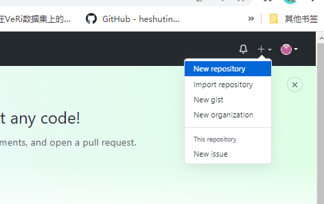
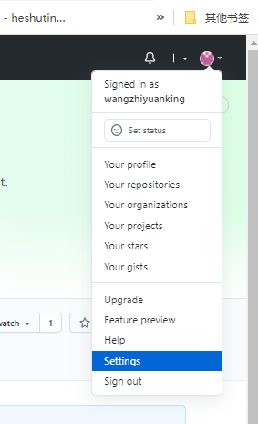
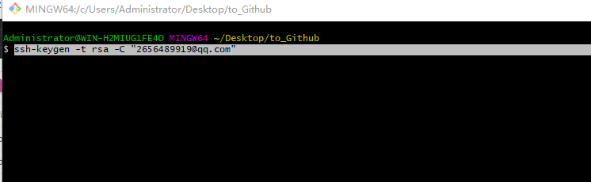
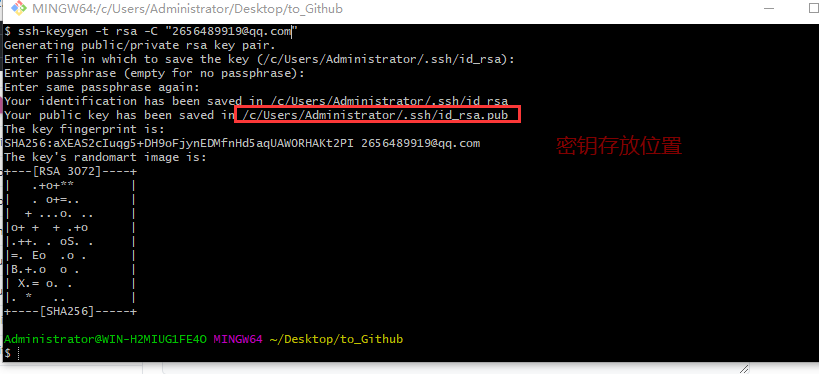
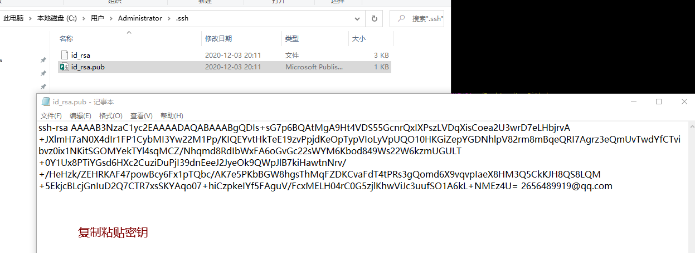
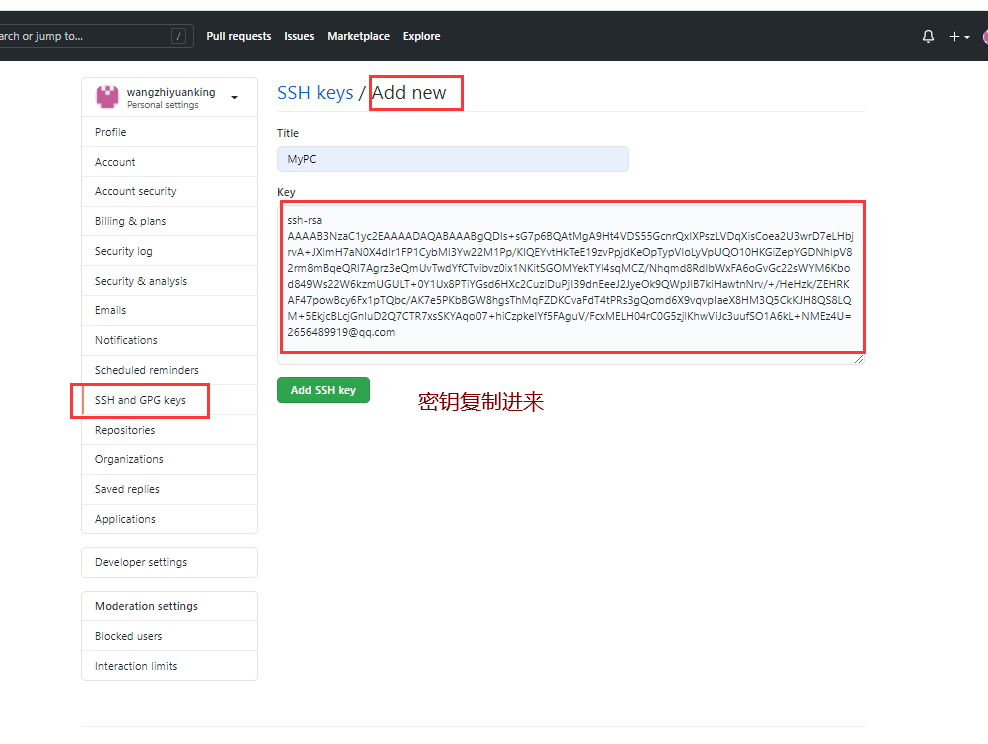
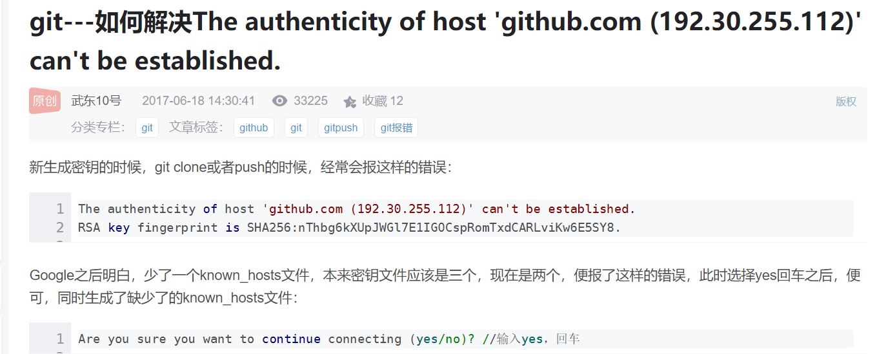
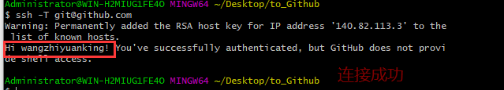
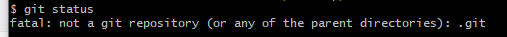
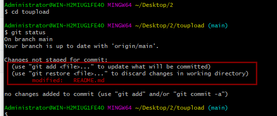

1、新建仓库



尽量不要自动添加README.md


所使用的电脑与github进行SSH连接



生成密钥

命令：ssh-keygen -t rsa -C "2656489919@qq.com"，连续按enter键








电脑已经和github进行了连接，可以相互通信了，测试是否连接成功代码 ssh -T git@github.com





电脑端配置，确定是谁上传的

```
git config --global user.name wangzhiyuan
git config --global user.email 2656489919
```


2、初始化仓库

```
git init
```

3、让git管理文件（使用.管理目录下的所有文件）

```
git add .
```

4、将文件提交到本地仓库中

```
git commit -m "对本次提交进行文字说明"
```

5、对已经存在的分支重命名

```
git branch -M main
```

6、关联远程github上的仓库

```
git remote add origin git@github.com:wangzhiyuanking/toupload.git
```

7、将本地仓库内容推到远程github仓库

```
git push -u origin main
```

更新代码到github上(一定要切换到项目目录上)



